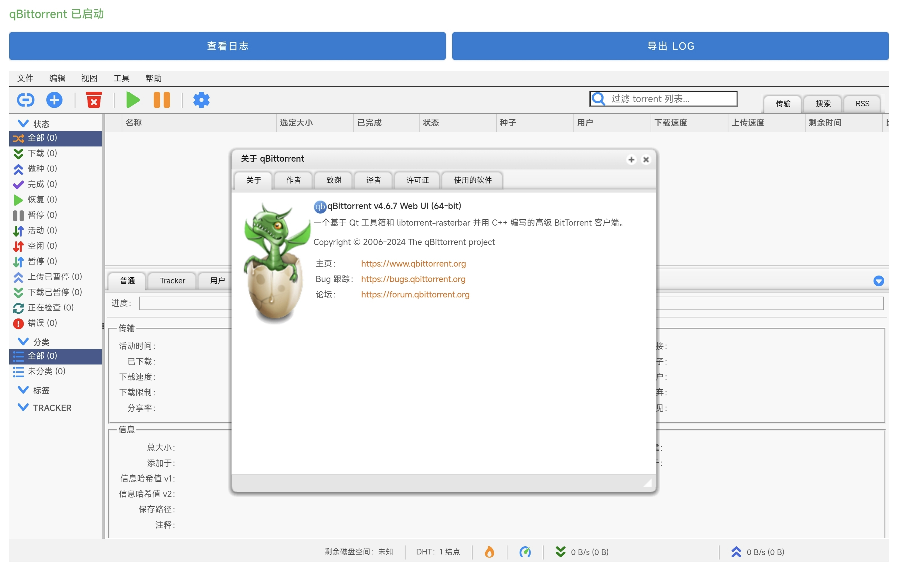

<p align="center">
  
</p>

<h1 align="center">qBittorrent for Android</h1>

<p align="center" style="font-size: 26px; font-weight: bold;">真正的安卓 qBittorrent 客户端！</p>


<p align="center">
  
</p>

将 [qBittorrent](https://www.qbittorrent.org/) 4.6.7 移植到 Android 平台，通过 WebView 访问 WebUI 进行操作。

并未支持PT下载，强行使用后果自负！

## 功能特性

- 完整的 qBittorrent 功能，通过 WebUI 访问
- 支持 ARM64 架构（arm64-v8a）
- 支持多语言界面（含中文）
- 自动初始化配置和密码设置
- 可自定义 WebUI 端口
- 可自定义默认下载路径
- 支持切换 WebUI（默认 WebUI / VueTorrent）
- 支持 BT/磁力链接下载
- 支持种子文件选择上传

## 技术架构

### 核心组件

1. **Qt5 框架**（预编译 qtbase 5.15.2）
   - 从 FAU 镜像下载预编译的 Android 版 qtbase
   - 仅需编译头文件，无需从源码编译 Qt

2. **libtorrent**（版本 2.0.10）
   - 交叉编译目标：`aarch64-linux-android24`
   - 使用 C++17 标准，静态链接

3. **qBittorrent**（版本 4.6.7）
   - 编译为共享库（libqbt.so）
   - 通过 JNI 桥接在 Android 进程内运行
   - 包含完整的 WebUI 翻译文件

4. **OpenSSL 3.3.2** + **Boost 1.86.0**
   - 静态编译，嵌入最终产物

### 关键技术问题及解决方案

#### 1. JNI_OnLoad 崩溃问题

**问题**：Qt5 的 `androidjnimain.cpp` 中的 `JNI_OnLoad` 初始化 GUI 平台插件，在无 GUI 环境下会崩溃。

**解决方案**：
- 禁用 `androidjnimain.cpp` 中的 `JNI_OnLoad`
- 在 `qjnihelpers.cpp` 中添加简单的 `JNI_OnLoad`，仅设置 JavaVM 指针
- 通过 JNI 桥接在 Android 进程内调用 qBittorrent main()

#### 2. TLS 对齐问题（Android 16/API 36）

**问题**：NDK r27 用 API 24 编译的二进制 TLS 对齐只有 8 字节，Android 16 linker 要求至少 64 字节。

**解决方案**：使用 `--target=aarch64-linux-android35` 编译，自动获得 64 字节 TLS 对齐。

#### 3. C++ 运行时不匹配

**问题**：静态链接 libc++ 和动态链接 libc++_shared.so 的 type_info 不兼容，导致 `std::bad_cast`。

**解决方案**：统一使用共享 `libc++_shared.so`。

#### 4. WebUI 翻译文件

**问题**：LinguistTools 不可用导致翻译文件未编译。

**解决方案**：
- 在 Docker 容器中安装 `qttools5-dev-tools`（提供 `lrelease`）
- 在 cmake configure 之前编译所有 `.ts` 文件为 `.qm` 文件
- 生成 QRC 文件，cmake 自动包含翻译资源

## 构建指南

### 方式一：GitHub Actions 自动构建（推荐）

1. Fork 本仓库
2. 在 Actions 页面手动触发 `Build qBittorrent Android APK` 工作流
3. 等待构建完成（约 10-15 分钟）
4. 在 Artifacts 页面下载 APK

### 方式二：本地 Docker 构建

#### 环境要求

- Docker Desktop
- 约 10GB 磁盘空间

#### 准备源码

将以下文件放入 `docker-sources/` 目录：

| 文件 | 说明 |
|------|------|
| `docker-sources-libtorrent.tar.gz` | libtorrent 源码（已在仓库中） |
| `docker-sources-qbittorrent.tar.gz` | qBittorrent 源码（已在仓库中） |

其余依赖（NDK、Qt5、OpenSSL、Boost）会在构建时自动下载，也可手动下载后放入 `docker-sources/` 加速构建。

#### 一键构建

```bash
docker build -t qbittorrent-android .
```

#### 提取产物

```bash
mkdir -p build-output
docker create --name qb-out qbittorrent-android
docker cp qb-out:/opt/qbt-output/lib/. ./build-output/
docker rm qb-out
```

#### 构建 APK

```bash
# 复制原生库到 jniLibs
cp build-output/libqbt_arm64-v8a.so apk-project/app/src/main/jniLibs/arm64-v8a/libqbt.so
cp build-output/libtorrent-rasterbar.so apk-project/app/src/main/jniLibs/arm64-v8a/
cp build-output/libc++_shared.so apk-project/app/src/main/jniLibs/arm64-v8a/

# 构建 APK
cd apk-project
./gradlew assembleRelease
```

APK 输出：`apk-project/app/build/outputs/apk/release/app-release.apk`（已签名，可直接安装）

## 使用说明

### 首次启动

1. 安装 APK 到 Android 设备
2. 打开应用，等待初始化完成（约 10-30 秒）
3. 默认密码：`adminadmin`
4. 点击"打开 WebUI"按钮访问界面

### WebUI 访问

- **本地访问**：http://localhost:8080（默认端口）
- **用户名**：admin
- **密码**：adminadmin（首次启动后显示在日志中）

### 设置功能

- **WebUI 切换**：支持默认 WebUI 和 VueTorrent，切换后自动重启应用
- **端口设置**：可自定义 WebUI 监听端口，重启后生效
- **下载路径**：可自定义默认下载路径，通过 API 立即生效
- **关于页面**：显示版本号、项目主页、致谢信息

### 语言设置

1. 打开 WebUI
2. 进入 设置 → WebUI → 语言
3. 选择"简体中文"或其他语言

## 目录结构

```
qbittorrent-android/
├── Dockerfile                    # Docker 构建环境（一步完成所有编译）
├── docker-sources/               # 源码和补丁
│   ├── docker-sources-libtorrent.tar.gz  # libtorrent 源码
│   ├── docker-sources-qbittorrent.tar.gz # qBittorrent 源码
│   └── patch-cmake.py            # CMakeLists.txt 补丁脚本
├── apk-project/                  # Android 项目
│   ├── app/
│   │   ├── src/main/
│   │   │   ├── java/             # Java 源码
│   │   │   ├── jniLibs/          # 原生库
│   │   │   └── res/              # 资源文件
│   │   └── build.gradle
│   └── build.gradle
└── .github/workflows/
    └── build-android.yml         # CI/CD 工作流
```

## 已知问题

1. **启动较慢**：首次启动需要 10-30 秒初始化
2. **内存占用**：Qt5 和 libtorrent 较大，建议设备至少 2GB RAM
3. **Android 版本**：仅支持 Android 8.0+（API 26+）
4. **架构限制**：仅支持 ARM64 设备

## 版本历史

### v1.1 (2026-07-08)

- 新增设置页面：WebUI 切换、端口设置、下载路径设置
- 新增 VueTorrent WebUI 支持（默认中文）
- 新增关于页面：版本号、项目主页、致谢信息
- 修复端口设置不生效的问题
- 修复下载路径设置不生效的问题
- 修复 WebUI 切换后不生效的问题
- 优化启动流程：端口轮询 + 加载提示
- 移除日志功能

### v1.0 (2026-07-05)

- 初始发布
- qBittorrent 4.6.7 移植到 Android
- 支持 WebUI 中文界面
- 自动配置和密码设置

## 致谢

- [qBittorrent](https://www.qbittorrent.org/) - 原始 BitTorrent 客户端
- [Qt](https://www.qt.io/) - 跨平台应用框架
- [libtorrent](https://www.libtorrent.org/) - BitTorrent 库
- [OpenSSL](https://www.openssl.org/) - 加密库
- [VueTorrent](https://github.com/WDaan/VueTorrent) - Vue.js WebUI

## 许可证

本项目遵循 [GPL-3.0 License](LICENSE)。

qBittorrent 本身是自由软件，遵循 GPLv2+ 许可证。
