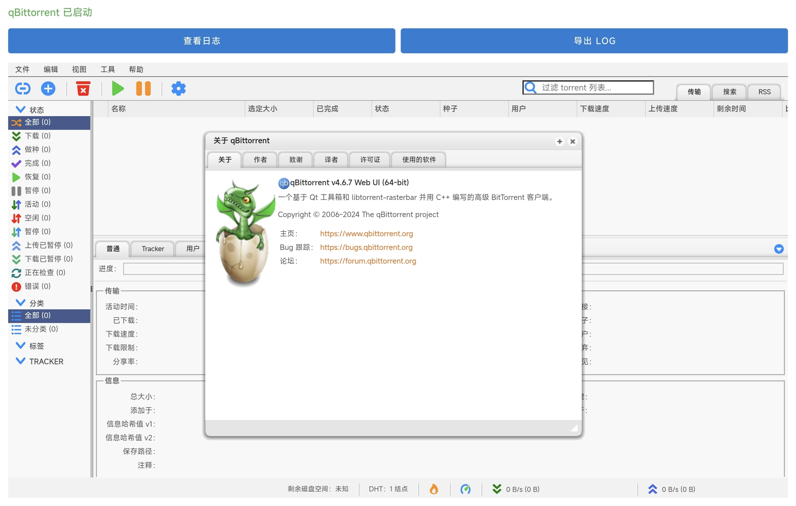

<p align="center">
  
</p>

<h1 align="center">qBittorrent for Android</h1>

<p align="center" style="font-size: 26px; font-weight: bold;">真正的安卓 qBittorrent 客户端！</p>


<p align="center">
  
</p>

将 [qBittorrent](https://www.qbittorrent.org/) 移植到 Android 平台，通过 WebView 访问 WebUI 进行操作。

**支持三个 qBittorrent 版本**（CI 矩阵构建，任选）：

| qBittorrent | libtorrent | Qt | C++ 标准 |
|---|---|---|---|
| 4.3.9 | 1.2.20 | 5.15.2 | 17 |
| 4.6.7 | 2.0.10 | 5.15.2 | 17 |
| 5.2.3 | 2.0.14 | 6.6.3 | 20 |

三个变体的内置 WebUI 统一为 **VueTorrent 2.34.0 中文默认版**
（`apk-project/app/src/main/assets/vuetorrent.zip`，来自
[Yizhou147/VueTorrent](https://github.com/Yizhou147/VueTorrent)），不按版本切换。

不推荐进行PT下载，强行使用后果自负！

## 功能特性

- 完整的 qBittorrent 功能，通过 WebUI 访问
- 支持 ARM64 架构（arm64-v8a）
- 支持多语言界面（含中文）
- 自动初始化配置和密码设置
- 可自定义 WebUI 端口
- 可自定义默认下载路径
- 支持切换 WebUI（默认 WebUI / VueTorrent）
- 支持 BT/磁力链接下载
- 支持种子文件选择上传

## 技术架构

### 核心组件

1. **Qt 运行时库**（源码重编，产物入库复用）
   - 4.3.9 / 4.6.7 使用 Qt 5.15.2 Android 版；5.2.3 使用 Qt 6.6.3（qb 5.x 要求 Qt ≥ 6.6，交叉编译需 QT_HOST_PATH）
   - 运行库由 `build-qt.yml` + `Dockerfile.qt` 从源码编译 qtbase（只编 Core/Network/Sql/Xml + tls/sqldrivers 插件），
     产物提交在 `third-party/qt5|qt6/arm64-v8a/`，主构建直接拷进 jniLibs，**不再重编 Qt**
   - 必须源码重编的原因见「关键技术问题 5」：预编译 Qt 的 `JNI_OnLoad` 依赖 Activity 上下文
   - 主构建的 `Dockerfile` 只用 aqtinstall 拉同版本 Qt 的**头文件 / CMake config / 宿主工具**
     （moc/rcc/uic）来编 libqbt，运行期用的是 `third-party/` 里那份

2. **libtorrent**
   - qb 4.3.9 → libtorrent 1.2.20；qb 4.6.7 → 2.0.10；qb 5.2.3 → 2.0.14
   - 必须用 `git clone --recursive` 获取源码（release tarball 缺 try_signal 子模块）
   - 交叉编译目标 `arm64-v8a`，动态链接 `libc++_shared.so`

3. **qBittorrent**
   - 编译为共享库（libqbt.so），通过 JNI 桥接在 Android 进程内运行
   - 源码改自官方 release tag，补丁见 `ci/patches/<版本>/`
   - 包含完整的 WebUI 翻译文件（宿主机 lrelease 预编译 .qm + qrc）

4. **OpenSSL 3.3.2** + **Boost 1.86.0**
   - 静态链接进 libtorrent 与 libqbt（`libqbt.so` 不依赖 libssl）
   - Qt 侧的 TLS 插件是动态链接的，所以 `third-party/*/arm64-v8a/` 里仍随包提供 `libssl.so` / `libcrypto.so`

### 关键技术问题及解决方案

#### 1. JNI_OnLoad 崩溃问题

**问题**：Qt5 的 `androidjnimain.cpp` 中的 `JNI_OnLoad` 初始化 GUI 平台插件，在无 GUI 环境下会崩溃。

**解决方案**：
- 禁用 `androidjnimain.cpp` 中的 `JNI_OnLoad`
- 在 `qjnihelpers.cpp` 中添加简单的 `JNI_OnLoad`，仅设置 JavaVM 指针
- 通过 JNI 桥接在 Android 进程内调用 qBittorrent main()
- Java 层动态扫描加载 `libQt5*`/`libQt6*`，同一份代码兼容两种 Qt

#### 2. TLS 对齐问题（Android 16/API 36）

**问题**：NDK r27 用 API 24 编译的二进制 TLS 对齐只有 8 字节，Android 16 linker 要求至少 64 字节。

**解决方案**：libtorrent 和 qBittorrent 用 `ANDROID_PLATFORM=android-35` 编译，自动获得 64 字节 TLS 对齐。

#### 3. C++ 运行时不匹配

**问题**：静态链接 libc++ 和动态链接 libc++_shared.so 的 type_info 不兼容，导致 `std::bad_cast`。

**解决方案**：统一使用共享 `libc++_shared.so`。

#### 4. WebUI 翻译文件

**问题**：LinguistTools 不可用导致翻译文件未编译。

**解决方案**：
- 容器内安装 `qttools5-dev-tools` / `qt6-l10n-tools`（提供宿主机 `lrelease`）
- 在 cmake configure 之前编译所有 `.ts` 文件为 `.qm` 文件
- 生成 QRC 文件，cmake 自动包含翻译资源（补丁将 LinguistTools 变为可选依赖）

#### 5. Android 进程内的 JNI 崩溃（Qt6 / JNI_OnLoad，5.2.3 打开 WebUI 闪退的根因）

**问题**：预编译 Qt（5.15.2 与 6.6.3 均如此）的 `libQt*Core` 在 `System.loadLibrary` 时执行
`JNI_OnLoad`，对本项目这种非 Qt-Activity 进程有两个层面的崩溃：
1. APK 里没有 Qt 的 Java 类时，`JNI_OnLoad` 内 `RegisterNatives` 抛
   `ClassNotFoundException` 返回 `JNI_ERR`，库加载失败，WebUI 永远起不来；
2. 若把 Qt 的 Java 类打进 APK 让 `JNI_OnLoad` 成功，Qt 的 Android 帮手代码被真正激活，
   运行期会执行依赖 Activity/ClassLoader 的 JNI 调用，在真机上以
   `GetStaticMethodID(java_class == null)` 等 abort 闪退。

**解决方案**：Docker 内**从源码重编 qtbase**（qt5.15.2 / qt6.6.3），补丁见
`ci/build-qt5.sh` / `ci/build-qt6.sh`：

- `JNI_OnLoad` 最小化：只设置 JavaVM 指针，不注册任何 natives；
- **同时缓存 app 的 ClassLoader 到 `g_jClassLoader`**：Qt 原本只在原版 `JNI_OnLoad` 里从
  `org.qtproject.qt.android.QtNative` 取值，而本 APK 不含那个 Java 类，于是
  `QJniObject::loadClass()` 对任何按类名的查找都返回 null——连
  `android/os/Environment`、`java/util/TimeZone` 这类系统类也拿不到。现改为从加载本库的
  `com.qbittorrent.android/QBittorrentService` 取（并带系统 ClassLoader 兜底）。
  运行时会往 logcat 打一行 `QtJNI: JNI_OnLoad: classLoader=ok`，用于区分「守卫兜住」和
  「类解析真的修好了」；
- **`qjniobject.cpp` 的 `getMethodID()` / `getFieldID()` 增加 NULL `jclass` 守卫**：
  Qt6 把 Android 实现改写成了类型化模板 `callStaticMethod<T>`，它不再判空；Qt5 的 varargs
  API 一直有判空，所以同样是「类解析不到」，Qt5（4.3.9 / 4.6.7）能静默降级，Qt6 直接被
  ART 判为致命错误（`java_class == null in call to GetStaticMethodID`）。
  5.2.3 的第一现场是启动末期首次构造 `QMimeDatabase`
  → `QStandardPaths::locateAll(GenericDataLocation, "mime")`
  → `writableLocation(GenericDataLocation)` → `getExternalStorageDirectory()`；
- `qjnienvironment.cpp` 增加 NULL `javaVM` 守卫。

**验证**：qb 5.2.3 在 CI emulator-smoke（run `34767720498`）与真机实测均通过。

#### 6. Qt6 资源 zstd 压缩（qb 5.x）

**问题**：Qt 6 的 rcc 默认用 zstd 压缩资源，生成的代码引用 `qt_resourceFeatureZstd` 符号，链接 Android 预编译 QtCore 时报 undefined symbol。

**解决方案**：补丁在 `CommonConfig.cmake` 给 `CMAKE_AUTORCC_OPTIONS` 追加 `--no-zstd`，回退 zlib 压缩。

#### 7. 旧版 qb 与新工具链的兼容

- **qb 4.3.9**：新 clang 将 narrowing 聚合初始化视为错误，libtorrent 1.2.20 编译参数追加 `-Wno-error=c++11-narrowing*`；`execinfo.h` 在 Android 不可用，关闭 STACKTRACE
- **qb 5.2.3**：使用 boost::stacktrace（未编译该模块），关闭 STACKTRACE

#### 8. qb 5.2.3 添加种子直接闪退（Boost 异常跨 DSO 未捕获）

**问题**：在 5.2.3 上，按 URL 添加种子、添加畸形磁力、上传损坏的 `.torrent`，都会立刻 SIGABRT：

```
Abort message: 'terminating due to uncaught exception of type
boost::system::system_error: unsupported URL protocol [libtorrent:24]'
backtrace: TorrentDescriptor::parse / load  <-  TorrentsController::addAction
```

**根因**：libtorrent 抛出的 `boost::system::system_error` 跨 DSO
（`libtorrent-rasterbar.so` → `libqbt.so`）时，qb 里的
`catch (const lt::system_error &)` 匹配不上（两个 DSO 各自静态链接了 Boost.System，
异常类型身份不一致），异常逃出 `noexcept` 函数即 `std::terminate` → abort。
qb 5.2.3 的 `TorrentDescriptor` 五个入口（`parse` / `load` / `loadFromFile` /
`saveToFile` / `saveToBuffer`）都是这个形状。

**为什么 4.3.9 / 4.6.7 不受影响**：它们没有 `TorrentDescriptor`，取种子/磁力用的是 libtorrent 的
**error_code 版本** API（`lt::parse_magnet_uri(url, params, ec)`、`lt::bdecode(data, ec, ...)`），
根本不抛异常，也就用不到这些 catch；只有 qb 5.x 新引入的 `TorrentDescriptor` 用的是**抛异常**的
封装（`lt::parse_magnet_uri(string)` / `lt::load_torrent_buffer(...)`），才踩到我们这种静态 Boost
构建下「跨 DSO 异常类型身份不一致」的坑。所以同一个 URL 在 4.3.9/4.6.7 正常、在 5.2.3 崩；
这个补丁只加在 5.2.3 上。

**解决方案**：`ci/patches/5.2.3/050-torrentdescriptor-catchall.patch` 给这五处各补
`catch (const std::exception &)` + `catch (...)`。`catch (...)` 不依赖类型匹配，是绕开
跨 DSO 类型身份问题的确定性兜底；异常退化为返回错误信息，WebUI 报错而不是进程崩溃。

**验证**（真机 adb 实测，修复前后对照）：

| 输入 | 修复前 | 修复后 |
|---|---|---|
| 正常磁力 | 正常添加 | 正常添加 |
| `https://…torrent` | SIGABRT | HTTP 409（https 取种子需 TLS 后端，见「已知问题 5」） |
| `http://…torrent` | — | HTTP 202，种子正常加入 |
| 畸形磁力（`btih:not_a_valid_hash`） | SIGABRT | HTTP 409 |
| 随机字节的 `.torrent` | SIGABRT | HTTP 415 + 明确错误提示 |

CI 侧由 `test.yml` 的「非法输入只报错不崩溃」步骤做回归。

## 构建指南

### 方式一：GitHub Actions 自动构建（推荐，唯一支持的 CI 方式）

1. 打开仓库 Actions 页面，选择 `Build qBittorrent Android APK`
2. 点击 `Run workflow`，选择要构建的 qBittorrent 版本（`all` = 三个版本并行）
3. 等待构建完成（单变体实测约 15 分钟；`all` 三个变体矩阵并行，整体时间取决于 runner 排队与并发）
4. 在 Artifacts 页面下载对应 APK（`qbittorrent-android-qb<版本>`）

推送 `v*` tag 会自动构建全部三个版本。

> Qt 运行时库由单独的 `Build Qt runtime libs` 工作流编译（实测 qt6 约 7 分钟），产物提交在
> `third-party/`。**只有改动 Qt 补丁（`ci/build-qt*.sh`）时才需要重跑它**；日常改 qb 补丁、
> Java 代码或 Gradle 配置都不需要动 Qt。

## 自动化测试

`test.yml` 工作流（与构建分开运行）：

1. **patch-check**：对 4.3.9 / 4.6.7 / 5.2.3 的官方源码试打移植补丁，断言关键标记
   （共享库化、JNI 桥接、翻译可选化、rcc `--no-zstd`），防止升级版本时补丁失效
2. **unit-tests**：JVM 单元测试（`./gradlew testReleaseUnitTest`），覆盖
   `QbtConfig` 的配置写入/改写/端口校验逻辑
3. **emulator-smoke**：构建工作流成功后自动触发，在 Android 30 模拟器（x86_64 +
   ARM 指令翻译）安装 APK，通过 `adb forward` 轮询本机 WebUI 端口并断言
   `/api/v2/app/version` 返回对应 qBittorrent 版本号；失败时上传 logcat

触发条件：push/PR 到 main 时跑 1、2；构建工作流完成后跑 3。

**冒烟测试不需要重新构建 APK**：`emulator-smoke` 用的是已有构建产物——

```bash
# 用某次构建的 APK 跑冒烟 (不触发任何编译)
gh workflow run test.yml -f build_run_id=<构建 run id>

# 留空则自动取最近一次成功的构建
gh workflow run test.yml
```

APK artifact 保留 90 天。所以验证测试代码本身、或复测某个历史版本的包时，不必重新出包；
只有 APK 内容真的改了（改 Java/qb 补丁/Qt 补丁）才需要重新构建。

### 签名（正式发布必须）

release 包使用固定密钥签名；否则每次 CI 构建的 debug key 都不同，用户无法覆盖安装。

- **本地/自建**：keystore 放任意位置（**不要放进仓库**，本仓库是 public），在
  `apk-project/signing.properties` 里写（该文件已被 `.gitignore` 排除）：

  ```properties
  storeFile=/绝对路径/keystore.jks
  storePassword=...
  keyAlias=...
  keyPassword=...        # 可省略，省略时与 storePassword 相同
  ```

- **CI**：仓库 Secrets 配 `QBT_KEYSTORE_BASE64`（keystore 的 base64）、
  `QBT_KEYSTORE_PASSWORD`、`QBT_KEY_ALIAS`、`QBT_KEY_PASSWORD`，工作流会解码后
  通过环境变量交给 Gradle。
- 两处都没有时回退 debug 签名（仅供调试，产物不能互相覆盖安装，日志里会有 warning）。
- 构建日志会打印 `apksigner verify --print-certs` 与 `aapt2 dump packagename`，可直接核对。

### 方式二：本地 Docker 构建

#### 环境要求

- Docker Desktop
- 约 10GB 磁盘空间

#### 准备源码

```bash
# 下载源码 + 应用移植补丁（同时会下载 OpenSSL/Boost）
./scripts/prepare-sources.sh 5.2.3        # 或 4.3.9 / 4.6.7
```

SDK/NDK 的三个 zip（platform-34 / build-tools 34 / NDK r27b）如未提前放入 `docker-sources/`，
请从 `dl.google.com/android/repository/` 手动下载，文件名见 `Dockerfile` 头部注释。

#### 一键构建

```bash
# qb 5.2.3 (Qt6)
docker build -t qbittorrent-android \
  --build-arg QT_KIND=qt6 --build-arg QT_VERSION=6.6.3 \
  --build-arg CXX_STANDARD=20 --build-arg EXTRA_CMAKE_FLAGS=-DSTACKTRACE=OFF .

# qb 4.3.9 / 4.6.7 (Qt5)
docker build -t qbittorrent-android \
  --build-arg QT_KIND=qt5 --build-arg QT_VERSION=5.15.2 \
  --build-arg CXX_STANDARD=17 .
```

#### 提取产物

```bash
mkdir -p build-output
docker create --name qb-out qbittorrent-android
docker cp qb-out:/output/lib/. ./build-output/
docker rm qb-out
```

#### 构建 APK

```bash
# 复制原生库到 jniLibs
cp build-output/libqbt_arm64-v8a.so apk-project/app/src/main/jniLibs/arm64-v8a/libqbt.so
cp build-output/*.so apk-project/app/src/main/jniLibs/arm64-v8a/

# 构建 APK
cd apk-project
./gradlew assembleRelease
```

APK 输出：`apk-project/app/build/outputs/apk/release/app-release.apk`（已签名，可直接安装）

## 使用说明

### 三个变体共存

三个变体的 applicationId 不同，可以同时安装、互不影响：

| 变体 | 包名 | 桌面名称 |
|---|---|---|
| qb 4.3.9 | `com.qbittorrent.android.qb439` | qBittorrent 4.3.9 |
| qb 4.6.7 | `com.qbittorrent.android.qb467` | qBittorrent 4.6.7 |
| qb 5.2.3 | `com.qbittorrent.android.qb523` | qBittorrent 5.2.3 |

注意：

- 包名与 v1.2 之前不同（当时是 `com.qbittorrent.android`），**首次需要卸载重装**；
  之后的新版本都能直接覆盖安装（从 v1.2 起 release 包用固定密钥签名，见「构建指南 → 签名」）。
- 三个变体的 WebUI 默认端口都是 8080，**建议同时只运行一个**；要同时使用，请在各自设置里
  改成不同端口。
- 默认下载目录都是 `/storage/emulated/0/Download/qBittorrent`，同时使用时也建议分别设置。

### 首次启动

1. 安装 APK 到 Android 设备
2. 打开应用，等待初始化完成（约 10-30 秒）
3. 默认密码：`adminadmin`
4. 点击"打开 WebUI"按钮访问界面

### WebUI 访问

- **本地访问**：http://localhost:8080（默认端口）
- **用户名**：admin
- **密码**：adminadmin（首次启动后显示在日志中）

### 设置功能

- **WebUI 切换**：支持默认 WebUI 和 VueTorrent，切换后自动重启应用
- **端口设置**：可自定义 WebUI 监听端口，重启后生效
- **下载路径**：可自定义默认下载路径，通过 API 立即生效
- **关于页面**：显示版本号、项目主页、致谢信息

### 语言设置

1. 打开 WebUI
2. 进入 设置 → WebUI → 语言
3. 选择"简体中文"或其他语言

## 目录结构

```
qbittorrent-android/
├── Dockerfile                    # 主构建环境: 编 libtorrent/libqbt（参数化 QT_KIND/QT_VERSION/CXX_STANDARD）
├── Dockerfile.qt                 # Qt 运行时库构建环境（build-qt.yml 使用）
├── ci/
│   ├── apply-patches.sh          # 给 vanilla qbittorrent 源码应用 Android 移植补丁
│   ├── build-qt5.sh              # 源码编译 qtbase 5.15.2 + JNI 补丁
│   ├── build-qt6.sh              # 源码编译 qtbase 6.6.3 + JNI 补丁
│   ├── build-native.sh           # libtorrent/libqbt 编译
│   └── patches/
│       ├── common/               # JNI 桥接（编入 libqbt.so）
│       ├── 4.3.9/                # 各版本补丁集
│       ├── 4.6.7/
│       └── 5.2.3/
├── third-party/                  # Qt 运行时库产物（build-qt.yml 生成，入库复用）
│   ├── qt5/arm64-v8a/
│   └── qt6/arm64-v8a/            # libQt6Core/Network/Sql/Xml + tls/sqldrivers 插件 + libssl/libcrypto
├── scripts/
│   ├── prepare-sources.sh        # 本地构建: 下载源码并打补丁
│   └── legacy/                   # v1.1 时期的构建/调试脚本 (已归档, 不再使用)
├── docker-sources/               # 构建前准备的第三方源码/工具链 zip（脚本生成，不入库）
├── apk-project/                  # Android 项目
│   ├── app/
│   │   ├── src/main/
│   │   │   ├── java/             # Java 源码
│   │   │   ├── assets/           # VueTorrent 2.34.0 中文版 zip
│   │   │   ├── jniLibs/          # 原生库（CI 构建时刷新）
│   │   │   └── res/              # 资源文件
│   │   └── build.gradle
│   └── build.gradle
└── .github/workflows/
    ├── build-android.yml         # 主构建: 矩阵构建三个版本的 APK
    ├── build-qt.yml              # Qt 运行时库（产物提交进 third-party/）
    ├── build-apk-prebuilt.yml    # 零编译出包: 复用仓库 jniLibs 里的原生库
    └── test.yml                  # patch-check / unit-tests / emulator-smoke
```

## 已知问题

1. **启动较慢**：首次启动需要 10-30 秒初始化
2. **内存占用**：Qt5 和 libtorrent 较大，建议设备至少 2GB RAM
3. **Android 版本**：`minSdk 24`（Android 7.0+），仅在较新版本上实测过，低版本未验证
4. **架构限制**：仅支持 ARM64 设备
5. **~~Qt 侧 HTTPS 与 SQLite 插件未加载~~（已修复）**：Qt 默认用编译期 prefix 找插件
   （设备上不存在），Qt 在 Android 上也拿不到系统 CA。修复（`android_jni_bridge.cpp`，
   在 qb 的 `main()` 之前执行）：

   - ① 桥接里 `setenv("QT_PLUGIN_PATH", <nativeLibraryDir>, 1)`，`libplugins_tls_*`、
     `libplugins_sqldrivers_*` 正常加载；
   - ② 把 Java 侧复制好的 `ca-certificates.crt` 注入
     `QSslConfiguration::defaultConfiguration()`，Qt 栈的 HTTPS（按 URL 添加种子、
     GeoIP 下载等）可用；
   - ③ HTTPS tracker 的证书校验由 libtorrent 处理：其 `set_default_verify_paths()`
     依赖编译期 OPENSSLDIR（设备上不存在），且 Android 的 CA 目录文件名是旧式 MD5
     哈希、OpenSSL 按 SHA1 查找永远命不中。构建时用 `ci/patch-libtorrent.py` 给
     libtorrent 打补丁，session 启动时显式 `load_verify_file()` 加载同一份 CA bundle；
     `ValidateHTTPSTrackerCertificate` 默认 **true**（真机已验证三变体的 https tracker
     通告正常）。v1.2 及更早的包默认关闭校验，覆盖安装后需在 WebUI 手动打开。

## 版本历史

### v1.2 (2026-09-13)

- 支持 qBittorrent 4.3.9 / 4.6.7 / 5.2.3 三版本矩阵构建
- **修复 qb 5.2.3（Qt6）打开 WebUI 时闪退**：`JNI_OnLoad` 缓存 app ClassLoader +
  `getMethodID`/`getFieldID` NULL `jclass` 守卫（详见「关键技术问题 5」），
  真机与 CI emulator-smoke 均通过
- **修复 qb 5.2.3 添加种子闪退**（按 URL / 畸形磁力 / 损坏文件触发，Boost 异常跨 DSO 未捕获）
- **三个变体改为不同包名**（`.qb439` / `.qb467` / `.qb523`）可同时安装；
  release 包改用固定密钥签名（可覆盖安装）
- 5.2.3 变体升级到 Qt 6.6.3 + C++20
- libtorrent/qBittorrent 改用 API 35 target 编译（修复 Android 16 TLS 对齐问题）
- 修复 CI 构建产物缺少 Qt 库的问题
- Java 层动态加载 Qt5/Qt6 库；清理死代码；改用 nativeLibraryDir 标准 API
- CI 源码改从官方 release 下载 + 统一补丁集，移除 Git LFS 源码包

### v1.1 (2026-07-08)

- 新增设置页面：WebUI 切换、端口设置、下载路径设置
- 新增 VueTorrent WebUI 支持（默认中文）
- 新增关于页面：版本号、项目主页、致谢信息
- 修复端口设置不生效的问题
- 修复下载路径设置不生效的问题
- 修复 WebUI 切换后不生效的问题
- 优化启动流程：端口轮询 + 加载提示
- 移除日志功能

### v1.0 (2026-07-05)

- 初始发布
- qBittorrent 4.6.7 移植到 Android
- 支持 WebUI 中文界面
- 自动配置和密码设置

## 致谢

- [qBittorrent](https://www.qbittorrent.org/) - 原始 BitTorrent 客户端
- [Qt](https://www.qt.io/) - 跨平台应用框架
- [libtorrent](https://www.libtorrent.org/) - BitTorrent 库
- [OpenSSL](https://www.openssl.org/) - 加密库
- [VueTorrent](https://github.com/WDaan/VueTorrent) - Vue.js WebUI
  （本项目使用其[中文默认版 fork](https://github.com/Yizhou147/VueTorrent) 2.34.0）

## 许可证

本项目遵循 [GPL-3.0 License](LICENSE)。

qBittorrent 本身是自由软件，遵循 GPLv2+ 许可证。
